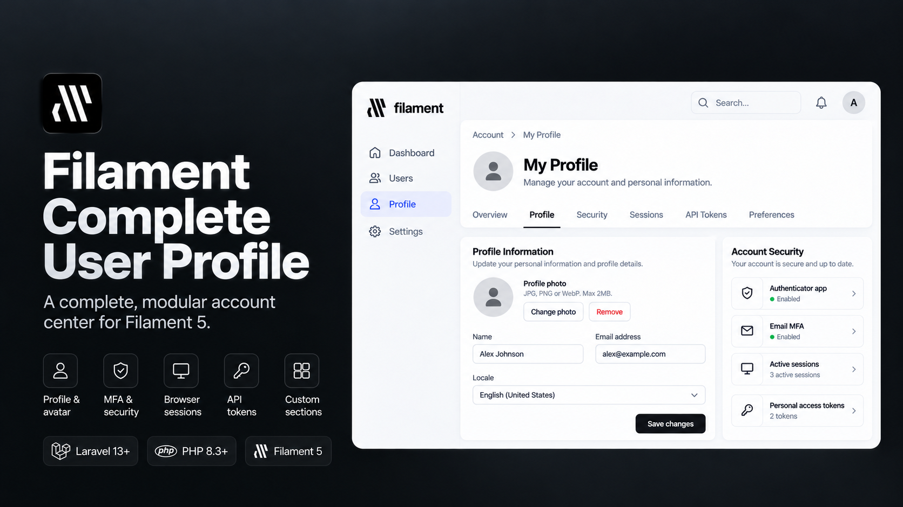

# Filament Complete User Profile

[](https://packagist.org/packages/mortalkiller/filament-complete-user-profile)
[](https://packagist.org/packages/mortalkiller/filament-complete-user-profile)
[](https://github.com/mortalkiller/filament-complete-user-profile/actions/workflows/tests.yml)
[](LICENSE.md)

[](https://plumbphp.dev/mortalkiller/filament-complete-user-profile)
[](https://plumbphp.dev/mortalkiller/filament-complete-user-profile)
[](https://plumbphp.dev/mortalkiller/filament-complete-user-profile)
[](https://plumbphp.dev/mortalkiller/filament-complete-user-profile)
[](https://plumbphp.dev/mortalkiller/filament-complete-user-profile)

A complete, modular account center for Filament 5 and Laravel 13.

## Documentation

Full documentation: **https://docs.pedromonteiro.dev/filament-complete-user-profile/**

- [Getting Started](https://docs.pedromonteiro.dev/filament-complete-user-profile/getting-started/installation/)
- [Configuration](https://docs.pedromonteiro.dev/filament-complete-user-profile/getting-started/configuration/)
- [API Reference](https://docs.pedromonteiro.dev/filament-complete-user-profile/api/)

It replaces Filament's simple profile screen with a normal panel page and lets you opt into account-security features such as multi-factor authentication, browser session management, Sanctum API tokens, and tenant-scoped tokens while keeping the default setup small.

## Screenshots

Real captures of the package's full local workbench with every built-in account feature enabled. The demo uses fictional user data and real Filament components.

| Area | Light | Dark |
| --- | --- | --- |
| Overview | 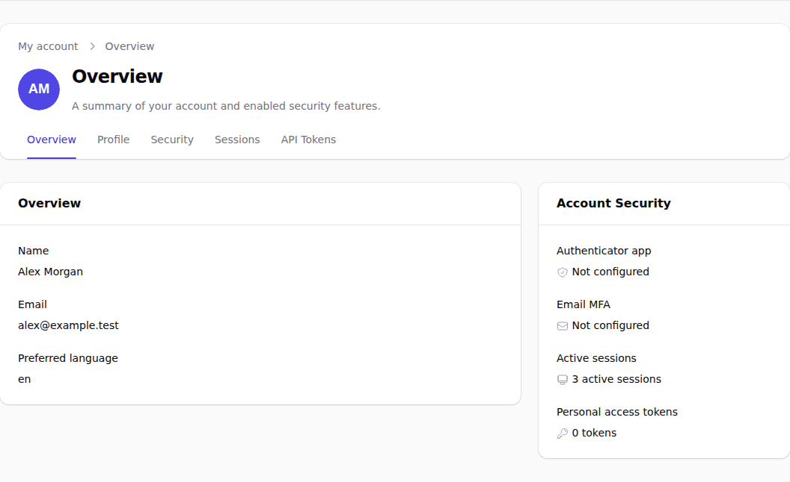 | 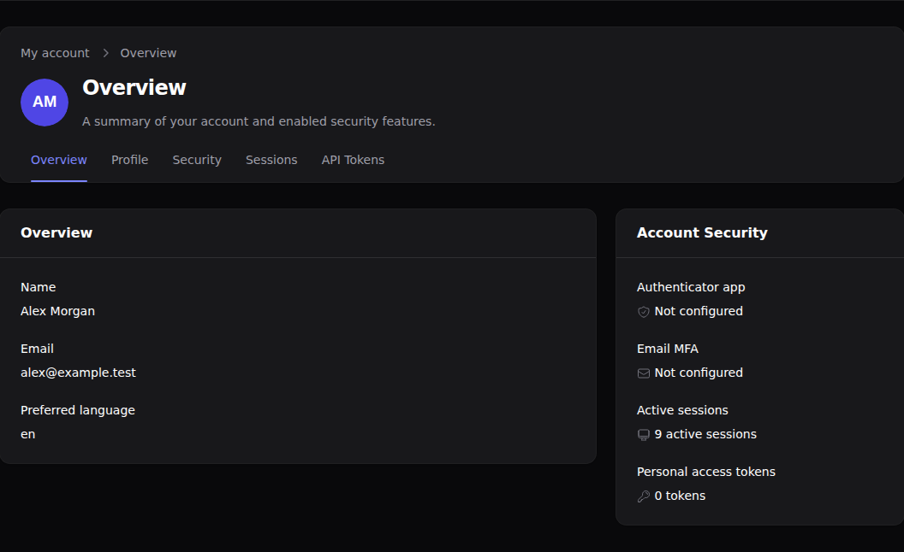 |
| Profile | 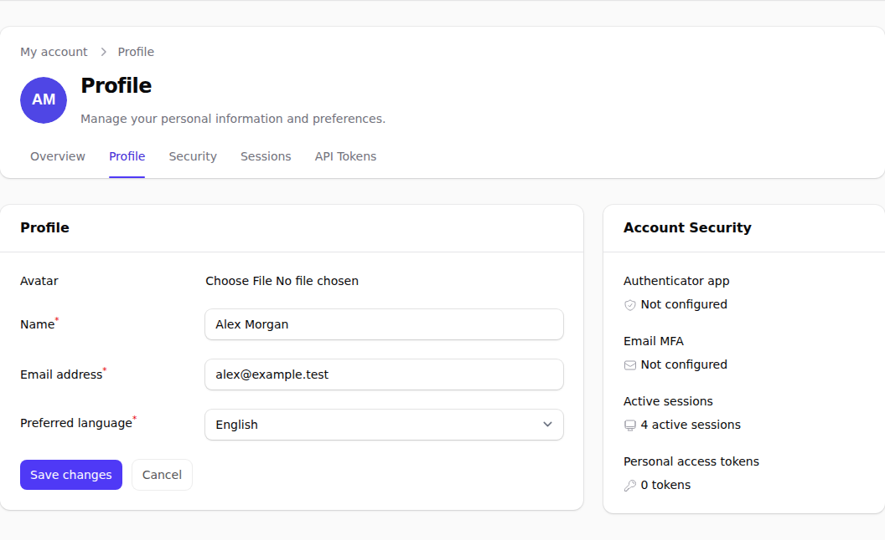 | 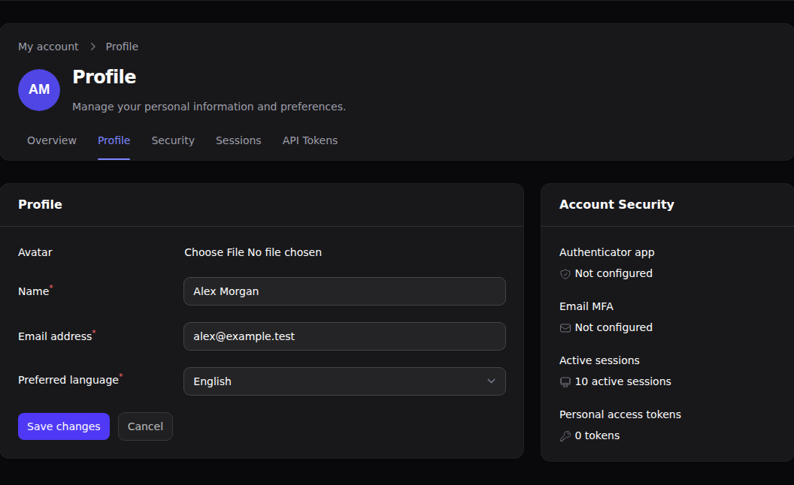 |
| Security | 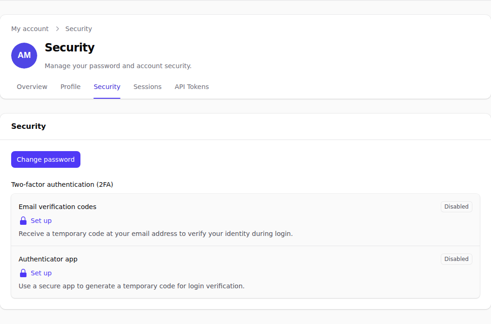 | 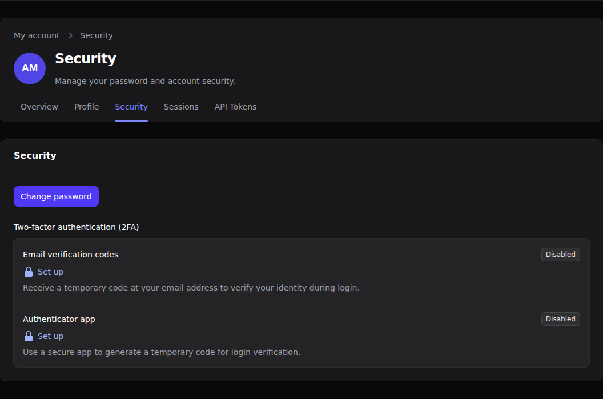 |
| Sessions | 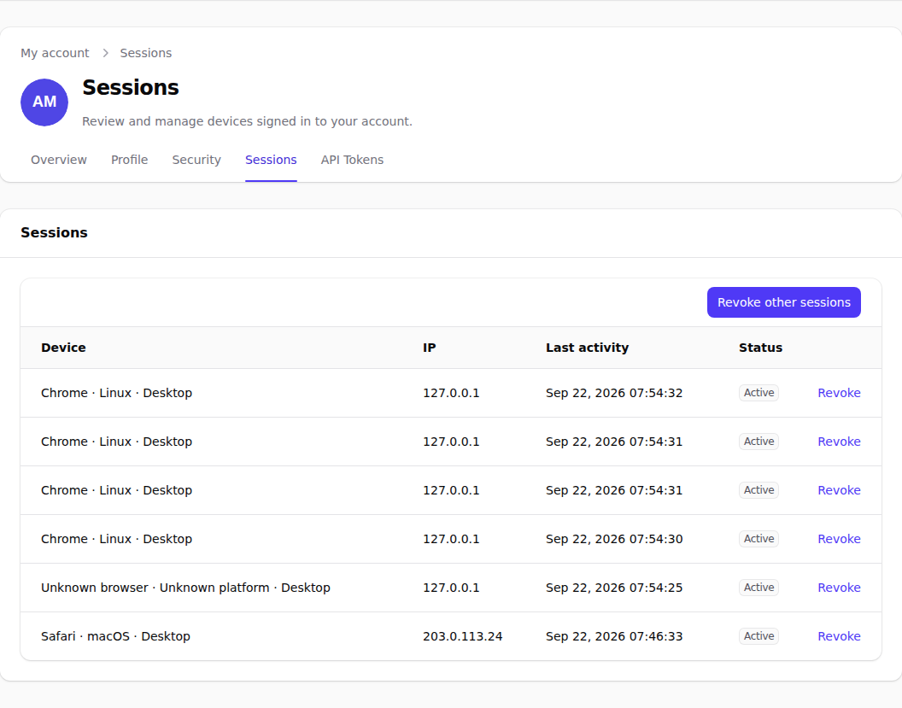 | 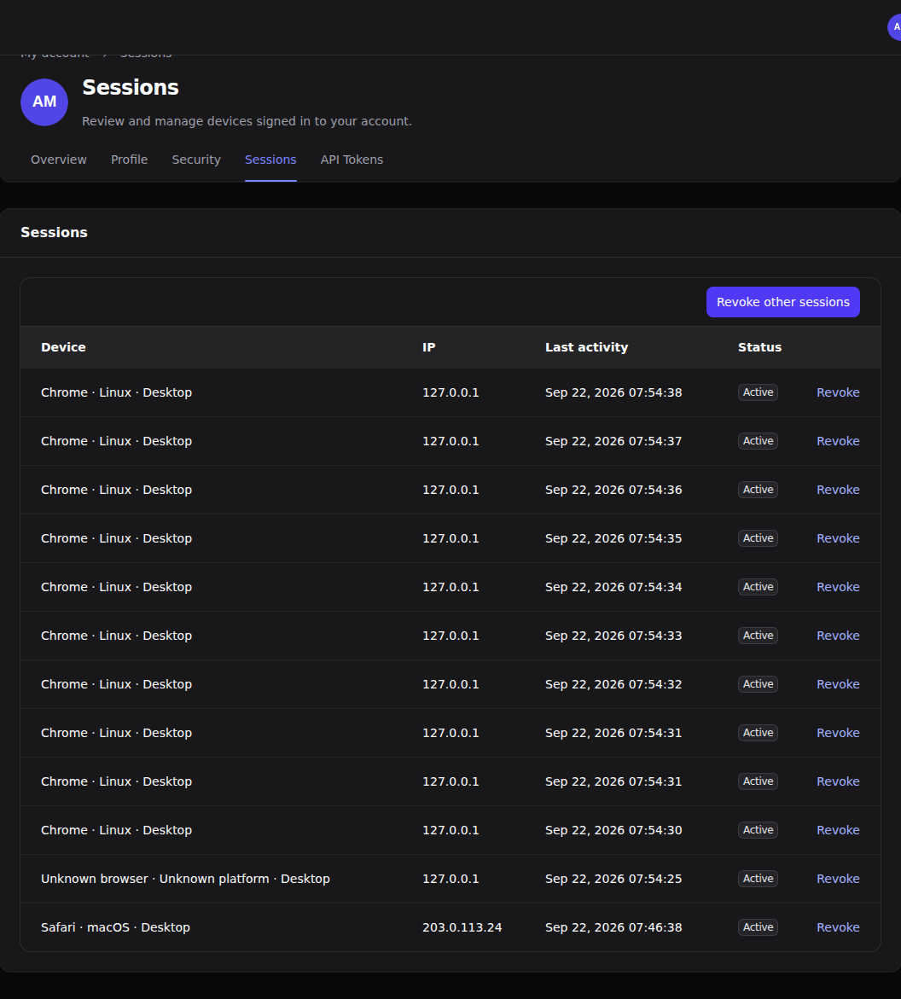 |
| API Tokens | 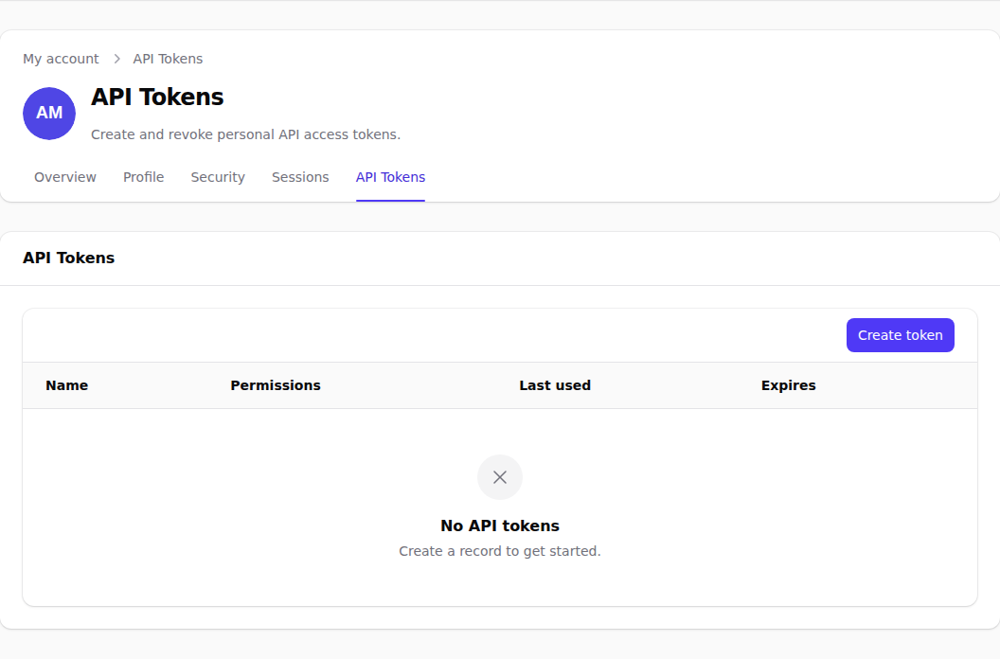 | 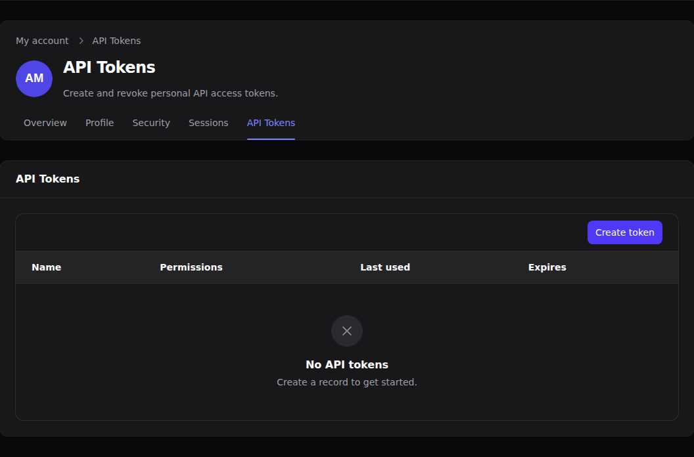 |
| Mobile Profile | 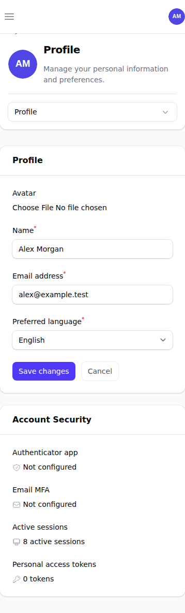 | 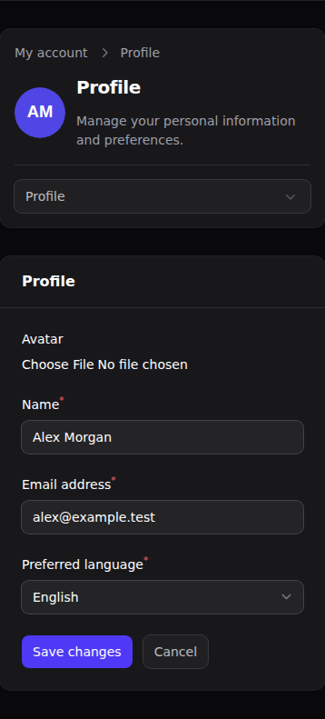 |

[Run the full demo locally](docs/testing.md) to explore every area and regenerate the screenshots.

## Requirements

Version 1 supports:

- PHP `^8.3`
- Laravel 13
- Filament `>=5.8.3 <6.0.0`
- `mortalkiller/filament-page-header` `^2.3.1` (required automatically via Composer; the plugin
  registers it on your panel for you)

Filament 4 and Filament 6 are not supported by the 1.x package line. The minimum Filament version
is 5.8.3. Filament 5.8.1 and 5.8.2 contain an upstream `DataStore` binding bug that can lose
Livewire per-component state when Filament's support provider is registered after Livewire; Filament
5.8.3 includes the upstream singleton fix. This baseline also remains above the earlier Filament 5
releases affected by the MFA security advisories relevant to this package.

## Installation

Install the package:

```bash
composer require mortalkiller/filament-complete-user-profile
```

The default storage mode is `user`. If that is what you want, run the migrations:

```bash
php artisan migrate
```

If you want `separate` profile storage, publish the config and select that mode **before the first package migration run**:

```bash
php artisan vendor:publish --tag=filament-complete-user-profile-config
```

```php
'storage' => 'separate',
```

Then run:

```bash
php artisan migrate
```

Storage mode is structural. Package migrations are only executed once by Laravel, so changing between `user` and `separate` after installation requires an application-owned migration/data migration for the transition.

Register the plugin on the Filament panel where you want to expose the account page:

```php
use Mortalkiller\FilamentCompleteUserProfile\CompleteUserProfilePlugin;

public function panel(Panel $panel): Panel
{
    return $panel
        ->plugins([
            CompleteUserProfilePlugin::make(),
        ]);
}
```

The package registers its account page in Filament's native profile slot with the standard panel layout, so the sidebar, topbar, workspace switcher, notifications, and user menu remain available.

You do not need to publish the config for the default setup. The package migrations are defensive: application-owned user columns are created only when missing and are intentionally preserved on rollback.

## Default experience

With only `CompleteUserProfilePlugin::make()`, the package enables:

- Overview
- Profile
- Avatar
- Name
- Email
- Locale
- Password management

Authenticator-app MFA, email MFA, browser sessions, and API tokens are disabled by default because each requires additional application infrastructure.

You can enable or disable the main areas from the panel provider:

```php
CompleteUserProfilePlugin::make()
    ->overview()
    ->profile()
    ->security()
    ->sessions(false)
    ->apiTokens(false);
```

Infrastructure and storage belong in the package config; feature behaviour belongs in the panel provider.

To publish the optional config:

```bash
php artisan vendor:publish --tag=filament-complete-user-profile-config
```

## Navigation layout

The account areas render as a single, iconless sub-navigation inside the account page's header, built with `mortalkiller/filament-page-header`. Every visible account area — built-in features and custom sections alike — appears as a tab in that header, and only the selected area's content renders below it. The selected area is reflected in the `section` query parameter, for example `?section=security`. Invalid or missing section values fall back to the first visible account area.

You register one plugin. `CompleteUserProfilePlugin` registers `PageHeaderPlugin` on the panel when it is not already there. To change the header mode without registering a second plugin:

```php
use MortalKiller\FilamentPageHeader\PageHeaderPlugin;
use Mortalkiller\FilamentCompleteUserProfile\CompleteUserProfilePlugin;

CompleteUserProfilePlugin::make()
    ->pageHeader(fn (PageHeaderPlugin $header): PageHeaderPlugin => $header->sticky());
```

If your application already registers `PageHeaderPlugin` on the same panel, that registration is authoritative in either order and `pageHeader()` is ignored.

This uses native Filament and `filament-page-header` components and requires no package-specific navigation CSS.

There is no way to opt out of the header (no `pageHeader(false)`). An application that wants Filament's stock profile heading instead must subclass `CompleteUserProfile` and override `headerSchema()`.

## Account Security summary

Beside the Overview and Profile areas, the page can render an "Account Security" summary card next to the main content. It lists up to four rows, each gated independently:

| Row | Appears when | State shown |
| --- | --- | --- |
| Authenticator app | Security is enabled and app authentication is configured | "Enabled" when the user has a stored app-authentication secret, otherwise "Not configured" |
| Email MFA | Security is enabled and email authentication is configured | "Enabled" when `hasEmailAuthentication()` returns `true` for the user, otherwise "Not configured" |
| Active sessions | Sessions is enabled **and** the session store is supported (database session driver with a migrated sessions table) | The user's active session count, correctly pluralized |
| Personal access tokens | API Tokens is enabled and the user model exposes a `tokens()` relation | The user's token count, correctly pluralized |

Each row links back to the account area it summarizes.

The sessions row is hidden entirely — not shown as "0 active sessions" — when the session store is unsupported (a non-database session driver, or a missing `sessions` table), since a confident zero would contradict the "unsupported" message the Sessions area itself shows in that situation. Every row is independently gated the same way: if none of the four apply, the card does not render at all, and the main content takes the full width.

The card is built by `CompleteUserProfile::getAccountSecurityAsideComponent(): ?Component`, a `protected` method you can override in a subclass to add, remove or reorder rows.

## Enable MFA

MFA providers are configured inside the Security feature. The package builds on Filament's native MFA providers and keeps Filament responsible for code generation, verification, and the authentication challenge flow.

Enable authenticator-app MFA with recovery codes:

```php
use Mortalkiller\FilamentCompleteUserProfile\Features\Security;

CompleteUserProfilePlugin::make()
    ->security(fn (Security $security): Security => $security
        ->appAuthentication());
```

Enable email-code MFA:

```php
CompleteUserProfilePlugin::make()
    ->security(fn (Security $security): Security => $security
        ->emailAuthentication());
```

Enable both and let Filament manage the available methods:

```php
CompleteUserProfilePlugin::make()
    ->security(fn (Security $security): Security => $security
        ->appAuthentication()
        ->emailAuthentication());
```

For authenticator-app MFA, your authenticatable Eloquent model must implement the package MFA contract and use its storage adapter trait:

```php
use Mortalkiller\FilamentCompleteUserProfile\Concerns\InteractsWithMultiFactorAuthentication;
use Mortalkiller\FilamentCompleteUserProfile\Contracts\HasMultiFactorAuthentication;

class User extends Authenticatable implements HasMultiFactorAuthentication
{
    use InteractsWithMultiFactorAuthentication;
}
```

For email MFA, implement Filament's native email-authentication contract, use the package storage trait, and ensure the model can send Laravel notifications:

```php
use Filament\Auth\MultiFactor\Email\Contracts\HasEmailAuthentication;
use Illuminate\Notifications\Notifiable;
use Mortalkiller\FilamentCompleteUserProfile\Concerns\InteractsWithEmailAuthentication;

class User extends Authenticatable implements HasEmailAuthentication
{
    use InteractsWithEmailAuthentication;
    use Notifiable;
}
```

Email MFA adds a server-enforced 60-second cooldown between verification-code sends. During the cooldown, the resend action is disabled and displays the remaining seconds. The verification code keeps Filament's native expiry window, which is currently 4 minutes by default.

The verification email is a queued Laravel notification. If your application uses an asynchronous queue connection such as `database` or `redis`, a queue worker must be running for codes to be delivered:

```bash
php artisan queue:work
```

With `QUEUE_CONNECTION=sync`, the notification is delivered in the request, which can be useful locally, but production applications should keep their normal queue strategy rather than switching to `sync` only for MFA email delivery.

The package-managed migrations provide the default authenticator-app secret, recovery-code, and email-MFA state columns when `storage` is `user`. Existing configured columns are reused rather than replaced.

Because MFA is registered at the Filament panel level, all authentication flows entering that panel must continue through Filament's MFA challenge. Do not bypass the panel's authentication completion flow from a custom social-login callback.

## Enable Sessions

Browser-session management requires Laravel database sessions:

```dotenv
SESSION_DRIVER=database
```

Create Laravel's sessions table if your application does not already have one, then run migrations:

```bash
php artisan make:session-table
php artisan migrate
```

Enable the feature:

```php
CompleteUserProfilePlugin::make()
    ->sessions();
```

The account page lists only sessions belonging to the authenticated user, marks the current session, prevents terminating the current session from the row action, and supports revoking all other sessions after reauthentication.

## Enable API Tokens

API-token management uses Laravel Sanctum. Install Sanctum in the host application and add `HasApiTokens` to the authenticatable model:

```bash
composer require laravel/sanctum
php artisan vendor:publish --provider="Laravel\Sanctum\SanctumServiceProvider"
php artisan migrate
```

```php
use Laravel\Sanctum\HasApiTokens;

class User extends Authenticatable
{
    use HasApiTokens;
}
```

Then enable the feature with an explicit ability whitelist:

```php
use Mortalkiller\FilamentCompleteUserProfile\Features\ApiTokens;

CompleteUserProfilePlugin::make()
    ->apiTokens(fn (ApiTokens $tokens): ApiTokens => $tokens
        ->abilities([
            'customers:read' => 'Read customers',
            'customers:write' => 'Manage customers',
        ])
        ->defaultExpiration(30)
        ->maxExpiration(90));
```

The whitelist is mandatory. Wildcard (`*`) abilities and abilities outside the configured list are rejected. The plaintext token is shown only immediately after creation and is cleared from the Livewire component when the confirmation modal is completed.

## Tenant-scoped tokens

Tenant-scoped tokens are opt-in and fail closed. They require all of the following:

1. Sanctum and `HasApiTokens`.
2. A current Filament tenant when a token is created, listed, or revoked.
3. Context columns on `personal_access_tokens`.
4. A `TokenContextResolver` binding for API requests.
5. `EnsureTokenContext` middleware after `auth:sanctum` on tenant-sensitive API routes.

Enable tenant scoping:

```php
CompleteUserProfilePlugin::make()
    ->apiTokens(fn (ApiTokens $tokens): ApiTokens => $tokens
        ->tenantScoped()
        ->abilities([
            'customers:read' => 'Read customers',
        ]));
```

Publish and run the opt-in migration:

```bash
php artisan vendor:publish --tag=filament-complete-user-profile-token-migrations
php artisan migrate
```

Bind the context resolver in your application service provider. The resolver must return the active tenant/context model for the current API request:

```php
use App\Models\Tenant;
use Illuminate\Database\Eloquent\Model;
use Mortalkiller\FilamentCompleteUserProfile\Contracts\TokenContextResolver;

$this->app->bind(TokenContextResolver::class, function (): TokenContextResolver {
    return new class implements TokenContextResolver {
        public function resolve(): ?Model
        {
            $tenant = request()->route('tenant');

            return $tenant instanceof Tenant ? $tenant : null;
        }
    };
});
```

Protect tenant-sensitive API routes after Sanctum authentication:

```php
use Mortalkiller\FilamentCompleteUserProfile\Http\Middleware\EnsureTokenContext;

Route::middleware([
    'auth:sanctum',
    EnsureTokenContext::class,
])->group(function (): void {
    // Tenant-sensitive API routes...
});
```

A missing resolver, missing context, token without context metadata, or context mismatch returns HTTP 403. A token created for one tenant cannot be listed, revoked, or accepted for another tenant through the package's tenant-scoped flow.

## Customize Profile fields

The package keeps Filament's native profile fields and exposes small extension points instead of requiring published views.

Configure locale options with locale codes; common language names are resolved automatically:

```php
use Mortalkiller\FilamentCompleteUserProfile\Features\Profile;

CompleteUserProfilePlugin::make()
    ->profile(fn (Profile $profile): Profile => $profile
        ->locale(['pt', 'en', 'es', 'fr']));
```

Associative arrays remain available when you want custom labels:

```php
->locale([
    'pt' => 'Português',
    'en' => 'English',
]);
```

Without explicit locale options, the package reads `app.available_locales`, then `app.supported_locales`, and finally falls back to `app.locale`.

Disable a default field:

```php
CompleteUserProfilePlugin::make()
    ->profile(fn (Profile $profile): Profile => $profile
        ->avatar(false));
```

Configure an existing field using the native Filament component:

```php
use Filament\Schemas\Components\Component;

CompleteUserProfilePlugin::make()
    ->profile(fn (Profile $profile): Profile => $profile
        ->name(fn (Component $field): Component => $field
            ->helperText('Your public display name.')));
```

Add fields:

```php
use Filament\Forms\Components\TextInput;

CompleteUserProfilePlugin::make()
    ->profile(fn (Profile $profile): Profile => $profile
        ->fields([
            TextInput::make('job_title'),
        ]));
```

For advanced cases, `Profile` also exposes `modifyFieldsUsing()`, `mutateDataBeforeSaveUsing()`, and `afterSave()`.

Additional custom fields are part of the host application's user/domain model; the package does not automatically create arbitrary columns for them.

## Custom account sections

Use a custom account section when you want a new first-class area in the account navigation rather than another field inside the existing Profile form. Register sections one at a time with the plugin's fluent `section()` method:

```php
use Filament\Schemas\Components\Text;
use Mortalkiller\FilamentCompleteUserProfile\AccountSection;

CompleteUserProfilePlugin::make()
    ->section(
        AccountSection::make('preferences')
            ->schema([
                Text::make('Manage your personal preferences here.'),
            ]),
    );
```

The section ID uses lowercase kebab-case. When no label is configured, the package derives one from the ID, so `connected-accounts` becomes `Connected Accounts`.

Configure navigation metadata with the same fluent style:

```php
use Filament\Schemas\Components\Text;
use Mortalkiller\FilamentCompleteUserProfile\AccountSection;

CompleteUserProfilePlugin::make()
    ->section(
        AccountSection::make('preferences')
            ->label('Preferences')
            ->description('Manage your personal preferences.')
            ->sort(25)
            ->visible(fn (): bool => auth()->user() !== null)
            ->schema([
                Text::make('Preferences content'),
            ]),
    );
```

Custom sections participate in the same ordering as the built-in account areas. Built-ins use their existing sort values, while a custom section defaults to sort `100`. A section with `sort(25)` therefore appears between Profile and Security with the default feature ordering.

For application-owned forms or other stateful interfaces, compose the section from a native Filament Livewire schema component:

```php
use Filament\Schemas\Components\Livewire;
use Mortalkiller\FilamentCompleteUserProfile\AccountSection;

CompleteUserProfilePlugin::make()
    ->section(
        AccountSection::make('preferences')
            ->label('Preferences')
            ->schema([
                Livewire::make(\App\Livewire\Account\Preferences::class),
            ]),
    );
```

`AccountSection` is a navigation and content extension point. It **does not automatically persist** fields to the user model, `ProfileStorage`, or any package-owned table. The application owns migrations, validation and persistence for domain-specific data rendered inside a custom section.

Use `Profile::fields()` when a field naturally belongs to the existing Profile form and should participate in that form's normal save flow. Use `AccountSection` when the feature deserves its own navigable area and can own its behaviour through native Filament schema components, Livewire components or actions.

The following IDs are reserved by the built-in package features and cannot be registered as custom sections:

- `overview`
- `profile`
- `security`
- `sessions`
- `api-tokens`

Registering a reserved ID or registering the same custom section ID twice throws a clear exception instead of silently overriding an existing area.

Custom account sections appear alongside built-in areas in the account navigation and use the same `?section=preferences` query-string selection. Hidden sections are excluded from navigation, and invalid or hidden section values fall back to the first visible account area.

## AccountSection API reference

`AccountSection` is intentionally small. The fluent configuration methods return the same section instance so configuration reads naturally from left to right.

### Fluent configuration

- `make(string $id)` creates a section. IDs must use lowercase kebab-case, for example `connected-accounts`.
- `label(string|Closure $label)` sets the navigation label. Without a label, the ID is converted to a headline.
- `description(string|Closure|null $description)` sets the description rendered in the page header when the section is active.
- `sort(int $sort)` controls ordering relative to built-in and custom account areas. The default is `100`.
- `visible(bool|Closure $condition = true)` controls whether the section can appear or be selected. The default is `true`.
- `schema(array|Closure $components)` defines the section content. The array or callback result must contain only Filament schema components.

### Read-only accessors

These methods expose the resolved section configuration for integrations and package-level customization:

- `getId()` returns the section ID.
- `getLabel()` returns the resolved label, including the generated headline fallback.
- `getDescription()` returns the resolved description or `null`.
- `getSort()` returns the configured sort value.
- `isVisible()` evaluates the visibility condition.
- `getSchema()` evaluates and validates the schema, returning the normalized list of Filament schema components.

### Plugin registration API

`CompleteUserProfilePlugin` exposes the following custom-section methods:

- `section(AccountSection $section)` registers one custom account section and returns the plugin for fluent chaining. Reserved or duplicate IDs throw a `LogicException`.
- `getSections()` returns all registered custom sections keyed by ID.
- `getVisibleSections()` returns only visible custom sections, ordered by their sort value.

There is intentionally no `sections()` method. Register sections one at a time with `section()` so the package has one canonical, autocomplete-friendly API.

## Structural config

Publishing the config is optional:

```bash
php artisan vendor:publish --tag=filament-complete-user-profile-config
```

The structural defaults are:

```php
return [
    'user_model' => null,

    'storage' => 'user',

    'columns' => [
        'avatar' => 'avatar_url',
        'locale' => 'locale',
        'mfa' => [
            'secret' => 'app_authentication_secret',
            'recovery_codes' => 'app_authentication_recovery_codes',
            'email_enabled' => 'has_email_authentication',
        ],
    ],

    'profile_table' => 'filament_user_profiles',
];
```

`user_model => null` resolves the model from Laravel's default authentication provider. Set it explicitly when the package should use another authenticatable model.

`storage => 'user'` stores avatar, locale, and package-managed MFA data on the configured user model. The migrations check each configured column before adding it.

`storage => 'separate'` stores package profile data in the package-owned `filament_user_profiles` table. This is useful when the host application should not add package-specific profile columns to its user table.

Feature toggles do not belong in this config. Configure features per Filament panel through `CompleteUserProfilePlugin`.

## Diagnostics

Run the installation checker after configuring the package or enabling an optional capability:

```bash
php artisan filament-complete-user-profile:check
```

The command reports `PASS`, `INFO`, and `FAIL` checks for the registered panels, user model, profile storage, configured profile columns, authenticator-app MFA, email MFA, database sessions, Sanctum, and tenant-token infrastructure.

It exits with code `0` when every enabled capability is ready and code `1` when an enabled capability is misconfigured. Disabled optional capabilities are informational and do not make the command fail.

## Advanced contracts

The package deliberately keeps authentication and tenancy integration replaceable through small contracts.

`Reauthentication` controls how sensitive account actions re-confirm the user's identity. The default implementation uses the current password when available. Applications with passwordless or social-only users can bind their own implementation.

`SessionStore` abstracts browser-session storage. The built-in implementation supports Laravel's database session driver.

`TokenContextResolver` resolves the active tenant/context for an authenticated API request when tenant-scoped tokens are enabled.

`HasMultiFactorAuthentication` is the package-facing contract that connects the user model to Filament's native authenticator-app MFA storage. `InteractsWithMultiFactorAuthentication` is the provided implementation for the package storage modes.

`InteractsWithEmailAuthentication` implements Filament's native email-MFA storage methods using the same package storage modes.

## Roadmap

See [docs/roadmap.md](docs/roadmap.md) for features being considered for future releases.

Roadmap items are exploratory and are not release commitments.

## Development

See [CONTRIBUTING.md](CONTRIBUTING.md) for contribution and maintenance guidance.

```bash
composer validate --strict
composer check
```

The GitHub Actions matrix validates supported PHP versions. A separate code-quality workflow verifies formatting, static analysis and tracked PHP syntax.

## Security

Please report vulnerabilities privately using the process in [SECURITY.md](SECURITY.md). Use GitHub Issues for ordinary bugs and feature requests.

## License

MIT. See [LICENSE.md](LICENSE.md).
